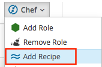
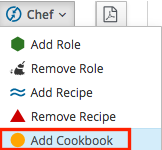

////
 userguide.adoc

-------------------------------------------------------------------------------
   Copyright 2016 Kevin Morey <kevin@redhat.com>

   Licensed under the Apache License, Version 2.0 (the "License");
   you may not use this file except in compliance with the License.
   You may obtain a copy of the License at

       http://www.apache.org/licenses/LICENSE-2.0

   Unless required by applicable law or agreed to in writing, software
   distributed under the License is distributed on an "AS IS" BASIS,
   WITHOUT WARRANTIES OR CONDITIONS OF ANY KIND, either express or implied.
   See the License for the specific language governing permissions and
   limitations under the License.
-------------------------------------------------------------------------------
////

= CloudForms Chef User Guide
Coming Soon!

== Table of Contents

* <<Bootstrap via Custom Button>>
* <<Bootstrap via Provisioning Workflow>>
* <<Add Role via Custom Button>>
* <<Remove Role via Custom Button>>
* <<Add Recipe via Custom Button>>
* <<Remove Recipe via Custom Button>>
* <<Add Cookbook via Custom Button>>
* <<Remove Cookbook via Custom Button>>
* <<Retire Chef Node/Client via Custom Button>>
* <<Retire Chef via Retirement Workflow>>
* link:troubleshooting.adoc[Troubleshooting Guide]

=== Bootstrap via Custom Button

* Log into your CloudForms/ManageIQ UI.
* Navigate to a VM.
* Under the *Chef* button group select *Bootstrap*.

* Navigate back to your VM. At the bottom of the summary page you should see *Custom Attributes* containing `Chef` attributes. Keep in mind that it could take a minute or so for the attributes to show up.

image:images/vm-bootstrap-customattributes.png[link=images/vm-bootstrap-customattributes.png]

<<top>>

=== Bootstrap via Provisioning Workflow

You can also add the bootstrap workflow to your provisioning statemachine(s) by adding
`/Integration/Chef/StateMachines/chef_bootstrap_${/#miq_provision.source.platform}`
to a step after the *CheckProvisioned*.

==== The Infrastructure provisioning statemachine is located:
`/Infrastructure/VM/Provisioning/StateMachines/VMProvision_VM/template`

==== The Cloud provisioning statemachine is located:
`/Cloud/VM/Provisioning/StateMachines/VMProvision_VM/template`

Example:

<<top>>

=== Add Role via Custom Button

* Log into your CloudForms/ManageIQ UI.
* Navigate to a VM.
* Under the *Chef* button group select *Add Chef Role*.

* Choose an available role and Submit.

* Navigate back to your VM. At the bottom of the summary page you should see *Custom Attributes* containing `Chef` attributes. You should see that the run_list has been updated.

<<top>>

=== Remove Role via Custom Button

* Log into your CloudForms/ManageIQ UI.
* Navigate to a VM where you have previously added a Chef role.
* Under the *Chef* button group select *Remove Chef Role*.

* Choose an existing role and Submit.

image:images/vm-removerole-dialog.png[link=images/vm-removerole-dialog.png]

* Navigate back to your VM. At the bottom of the summary page you should see *Custom Attributes* containing `Chef` attributes. You should see that the run_list has been updated.

<<top>>

=== Add Recipe via Custom Button

* Log into your CloudForms/ManageIQ UI.
* Navigate to a VM.
* Under the *Chef* button group select *Add Chef Role*.

* Choose an available recipe and Submit.

* Navigate back to your VM. At the bottom of the summary page you should see *Custom Attributes* containing `Chef` attributes. You should see that the run_list has been updated.

<<top>>

=== Remove Recipe via Custom Button

* Log into your CloudForms/ManageIQ UI.
* Navigate to a VM where you have previously added a Chef recipe.
* Under the *Chef* button group select *Remove Chef Role*.

* Choose an existing recipe and Submit.

* Navigate back to your VM. At the bottom of the summary page you should see *Custom Attributes* containing `Chef` attributes. You should see that the run_list has been updated.

<<top>>

=== Add Cookbook via Custom Button

* Log into your CloudForms/ManageIQ UI.
* Navigate to a VM.
* Under the *Chef* button group select *Add Chef Cookbook*.

* Choose an available cookbook and Submit.

image:images/vm-addcookbook-dialog.png[link=images/vm-addcookbook-dialog.png]

* Navigate back to your VM. At the bottom of the summary page you should see *Custom Attributes* containing `Chef` attributes. You should see that the run_list has been updated.

<<top>>

=== Remove Cookbook via Custom Button

* Log into your CloudForms/ManageIQ UI.
* Navigate to a VM where you have previously added a Chef cookbook.
* Under the *Chef* button group select *Remove Chef cookbook*.

* Choose an existing cookbook and Submit.

* Navigate back to your VM. At the bottom of the summary page you should see *Custom Attributes* containing `Chef` attributes. You should see that the run_list has been updated.

image:images/vm-removecookbook-customattributes.png[link=images/vm-removecookbook-customattributes.png]

<<top>>

=== Retire Chef Node/Client via Custom Button

* Log into your CloudForms/ManageIQ UI.
* Navigate to a VM where you have previously bootstrapped a Chef client.
* Under the *Chef* button group select *Retire Chef Client*.

* Navigate back to your VM. At the bottom of the summary page you should see all `Chef` *Custom Attributes* and `Tags` cleared.

<<top>>

=== Retire Chef via Retirement Workflow

You can add the Chef Retirement workflow to your retirement statemachine(s) by adding the following:

 /Integration/Chef/StateMachines/chef_retire

<<top>>
